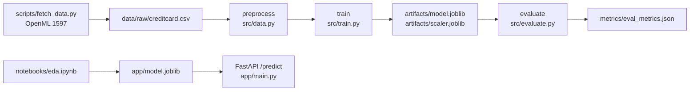

# ml-end-to-end-pipeline

A credit card fraud classifier taken from notebook to a versioned pipeline to a served API. The model is deliberately simple (logistic regression). The point of the repo is the path around it: DVC stages that rebuild data, model and metrics from one command, a FastAPI service, a Docker image, and CI.

## Problem

The ULB credit card dataset has 284,807 transactions and 492 frauds, a positive rate of 0.17%. On data like this a model can report 97% accuracy and still be close to useless, so the interesting questions are how many frauds it catches, how many false alarms it raises to do so, and whether anyone can reproduce those numbers from a clean clone.

## Architecture



The three pipeline stages are defined in `dvc.yaml`, so `dvc repro` only reruns a stage when its code, parameters or inputs change. The API serves a separate model that the notebook exported. See Limitations.

## Quickstart

```bash
git clone https://github.com/armaanwaels/ml-end-to-end-pipeline.git
cd ml-end-to-end-pipeline
python3.11 -m venv .venv && source .venv/bin/activate
make deps
make data        # downloads the dataset from OpenML, about 150 MB
make pipeline    # dvc repro: preprocess, train, evaluate
make metrics
make test
```

Run the API:

```bash
cd app && docker build -t credit-fraud-api . && docker run -p 8000:8000 credit-fraud-api
curl -X POST localhost:8000/predict -H 'Content-Type: application/json' \
  -d '{"features": [0,0,0,0,0,0,0,0,0,0,0,0,0,0,0,0,0,0,0,0,0,0,0,0,0,0,0,0,0,0]}'
```

The API expects 30 features in the Kaggle column order: `Time`, `V1` to `V28`, `Amount`. A hosted copy runs on Render at https://ml-end-to-end-pipeline.onrender.com/docs. It serves the same notebook-exported model.

## Evaluation

Logistic regression with balanced class weights, stratified 80/20 split, `random_state=42`, decision threshold 0.5. The test set has 56,962 transactions, 98 of them fraud.

| Data | Accuracy | Precision | Recall | F1 | ROC AUC | PR AUC |
|---|---|---|---|---|---|---|
| OpenML mirror (`make data && make pipeline`) | 0.977 | 0.060 | 0.867 | 0.113 | 0.970 | 0.709 |
| Kaggle file (commit `e676cbb`, not rerun here) | 0.978 | 0.064 | 0.867 | 0.119 | 0.970 | not recorded |

Confusion matrix on the OpenML run (`metrics/eval_metrics.json`): 85 of 98 frauds caught, 13 missed, 1,324 legitimate transactions flagged. So roughly 16 false alarms for every fraud caught.

The OpenML copy is the same dataset without the `Time` column, which is why the rows differ slightly. The second row is what `dvc repro` produced on the Kaggle file before I added the OpenML fetch. To reproduce it, download `creditcard.csv` from [Kaggle](https://www.kaggle.com/mlg-ulb/creditcardfraud) into `data/raw/` and run `make pipeline`.

## Decisions and tradeoffs

- **Logistic regression over a tree ensemble.** The notebook compares it against a random forest. I kept the linear model in the pipeline because it trains in seconds, which keeps `dvc repro` and CI fast, and its errors are easy to reason about. It is not the most accurate choice.
- **Balanced class weights instead of resampling.** Weighting the loss avoids generating synthetic frauds. The cost is shown in the table: at a 0.5 threshold the model leans hard toward flagging.
- **DVC for pipeline state.** Stages declare their inputs, so changing a parameter reruns training and evaluation but not preprocessing. Metrics JSON is committed to git so changes show up in diffs.
- **OpenML as the default data source.** Kaggle needs an account and an API token, and the DVC remote was only ever a local folder. OpenML lets a fresh clone run the whole pipeline with no credentials.

## What went wrong / limitations

- **The served model is not the pipeline's model.** `app/model.joblib` was exported from the notebook, trained on the Kaggle file with 30 features. The pipeline writes a 29-feature model (no `Time`) to `artifacts/` and nothing copies it into `app/`. Closing that gap is the next change.
- **The threshold is not tuned.** Precision of 6% at 0.5 is the default threshold, not a chosen operating point. PR AUC of 0.709 shows the ranking is much better than that; picking a threshold on a validation split for a target precision or recall would help more than a new model.
- **Train and eval metrics are the same numbers.** `train.py` and `evaluate.py` score the same held-out split. There is no separate validation set.
- **`params.yaml` promises more than the code does.** The `train` section lists random forest and XGBoost options that `train.py` ignores. `src/model.py` is not used by any stage.
- **No DVC remote.** `dvc pull` has nothing to pull. Data comes from `make data` instead.
- **The API does not validate input length.** A request with the wrong number of features returns a 500 instead of a 422.
- **CI was red from the first push until this README's commit.** The workflow ran `ruff` and `pytest` with neither installed and no tests. It now runs lint and two tests: the three pipeline stages on a small synthetic CSV, and the API against the committed model.

## Stack

Python 3.11, pandas, scikit-learn, DVC, FastAPI, Docker, GitHub Actions, Render.
